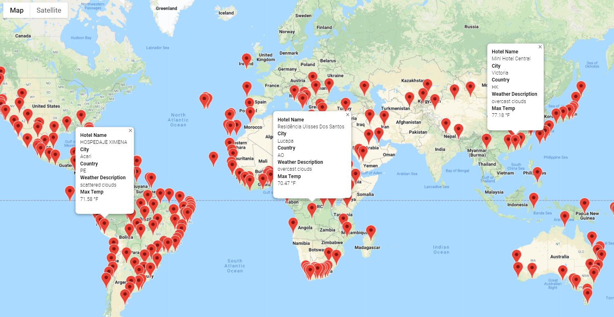
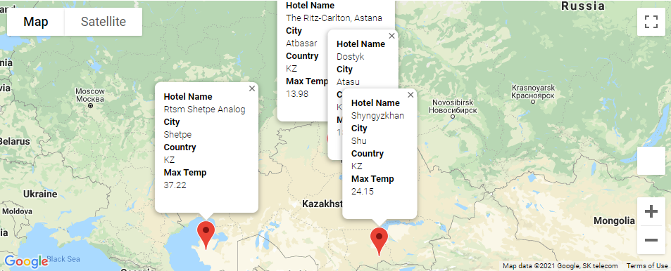
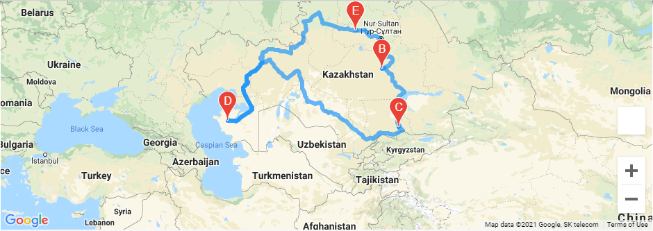

# World_Weather_Analysis

## Overview of the Analysis:

Collect the Data
Use the NumPy module to generate more than 1,500 random latitudes and longitudes.
Use the citipy module to list the nearest city to the latitudes and longitudes.
Use the OpenWeatherMap API to request the current weather data from each unique city in your list.
Parse the JSON data from the API request.
Collect the following data from the JSON file and add it to a DataFrame:
City, country, and date
Latitude and longitude
Maximum temperature
Humidity
Cloudiness
Wind speed
Exploratory Analysis with Visualization
Create scatter plots of the weather data for the following comparisons:
Latitude versus temperature
Latitude versus humidity
Latitude versus cloudiness
Latitude versus wind speed
Determine the correlations for the following weather data:
Latitude and temperature
Latitude and humidity
Latitude and cloudiness
Latitude and wind speed
Create a series of heatmaps using the Google Maps and Places API that showcases the following:
Latitude and temperature
Latitude and humidity
Latitude and cloudiness
Latitude and wind speed
Visualize Travel Data
Create a heatmap with pop-up markers that can display information on specific cities based on a customer's travel preferences. Complete these steps:
Filter the Pandas DataFrame based on user inputs for a minimum and maximum temperature.
Create a heatmap for the new DataFrame.
Find a hotel from the cities' coordinates using Google's Maps and Places API, and Search Nearby feature.
Store the name of the first hotel in the DataFrame.
Add pop-up markers to the heatmap that display information about the city, current maximum temperature, and a hotel in the city.

### Purpose:

Task: Collect and analyze weather data across cities worldwide.
Purpose: PlanMyTrip will use the data to recommend ideal hotels based on clients' weather preferences.
Method: Create a Pandas DataFrame with 500 or more of the world's unique cities and their weather data in real time. This process will entail collecting, analyzing, and visualizing the data.

## Resources

**Data Source:** .csv, .csv.

**Software:** Jupyter, Python graphing library Matplotlib.

## Results:
	
	
	

## Summary:

- Deliverable 1: Retrieve Weather Data
- Deliverable 2: Create a Customer Travel Destinations Map
- Deliverable 3: Create a Travel Itinerary Map

The Weather_Database folder with the following:

- The Weather_Database.ipynb file
- The WeatherPy_Database.csv file

The Vacation_Search folder with the following:

- The Vacation_Search.ipynb file
- The WeatherPy_vacation.csv file
- The WeatherPy_vacation_map.png image

The Vacation_Itinerary folder with the following:

- The Vacation_Itinerary.ipynb file
- The WeatherPy_travel_map.png image
- The WeatherPy_travel_map_markers.png image

